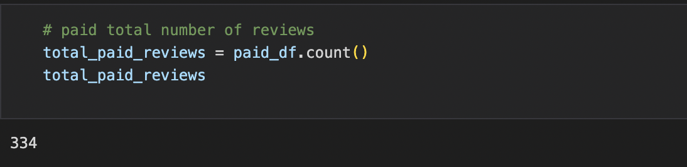
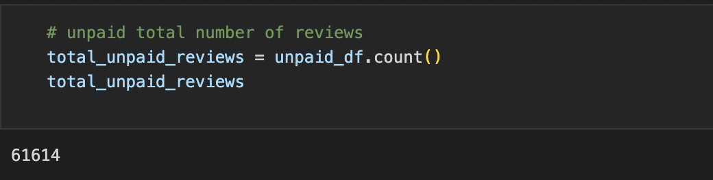
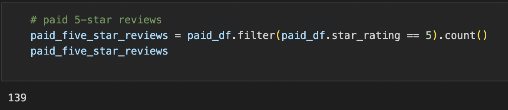
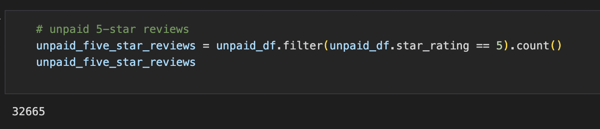
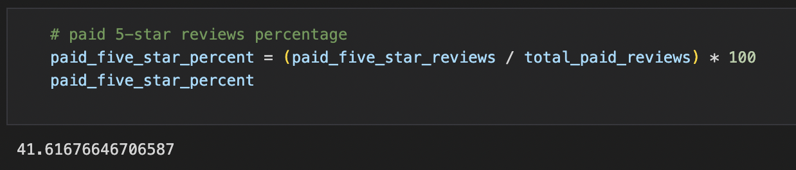
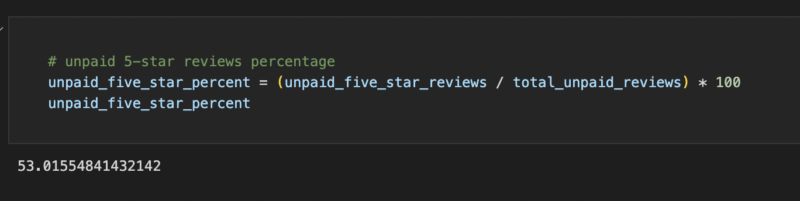

# Amazon_Vine-Analysis

## Purpose

The purpose of this project is to analyze Amazon reviews written by members of the paid Amazon Vine program, a service that allows manufacturers and publishers to receive reviews of their products and determine if there are any biases between Vine members and Non-Vine member's reviews.

Companies that will pay a fee to Amazon and may provide free products to Vine members who are then required to publish a review. In order to determine if there is any bias towards favorable reviews from Vine members vs. non-members, we need to identify the percentage of 5 star ratings to total rating. As part of this exercise, I selected a dataset from their sports catergory. Throughout this analysis, I:

 - Used PySpark to inspect, extract, and transform the data
 - connected to AWS RDS instance and transformed the data in PgAdmin
 - Used Google Colab to import PySpark libraries and connect Postgres to create SQL tables and export results.

The Analysis is below

## Results

### Total number of paid Vine Reviews Vs. non paid Vine Reviews

</img>

Paid Review

</img>

Unpaid Review 

### Number of paid 5-Star Vine Reviews Vs. non paid 5-Star Vine Reviews 
</img>

Paid 5-Star Vine reviews

</img>

Unpaid 5-Star Vine Reviews

### Percentage of paid 5-Star Vine Reviews Vs. non paid 5-Star Vine Reviews
</img>

Paid Percentage

</img>

Unpaid Percentage
